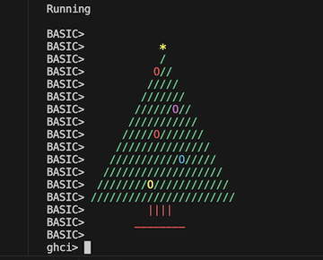

# HaskellTreeDSL

A minimal [BASIC](https://en.wikipedia.org/wiki/BASIC)-like [Domain Specific Language](https://en.wikipedia.org/wiki/Domain-specific_language) (DSL), implemented in [Haskell](https://www.haskell.org) 🧐.

This project is a demo, with 'minimum viable' BASIC language features largely implemented through AI code generation.



The BASIC code, for the tree _outline_ (without decorations), looks like this:
```basic
10 FOR i = 1 TO 12
20 LET spaces = 12 - i
30 LET tree = i * 2 - 1
40 FOR j = 1 TO spaces
45 COLOR "Green"
50 PRINT " ";
60 NEXT j
70 FOR k = 1 TO tree
80 PRINT "/";
90 NEXT k
100 PRINT
110 NEXT i
125 COLOR "Brown"
120 PRINT "         ||||"
125 COLOR "Red"
130 PRINT "       ________"
```

## Background

ChatGPT generated the BASIC outline for the tree, without decorations, and the fundamentals of the Haskell parser.

To improve the accuracy of the generated code, a custom GPT was used, [Haskell Parser Helper GPT](https://chat.openai.com/g/g-mwn9vJgLk-haskell-parser-helper), with key help files from [Megaparsec](https://github.com/mrkkrp/megaparsec) loaded as knowledge. This did seem to improve the generated code accuracy to a degree, but further refinement is needed. The parser is not entirely AI generated, it needed a little tweaking to fix a couple of end of line / keyword handling issues that crept in.


## devcontainer
This project 'should' launch in a devcontainer: https://marketplace.visualstudio.com/items?itemName=ms-vscode-remote.remote-containers

## run
build and run as a binary:
```bash
stack run
```

## to debug / develop
run in ghci:
```bash
stack ghci

ghci> SamplePrograms.main
```
`SamplePrograms.hs` contains other programs to run, with a little tweaking.

## test cases
run the test cases:
```bash
stack ghci --test

(option 2)

ghci> Main.main
```


---
## Additional notes:

#### Testing
List the tests:
```bash
stack test --test-arguments "--dry-run"
```

Run a specific test:
```bash
stack test --test-arguments "-m \"parses valid LET statement"\"

stack test --test-arguments "-m \"parses valid LET statement with arithmetic"\"

stack test --test-arguments "-m \"FOR NEXT program tests/parses valid FOR statement in program, with PRINT"\"

stack test --test-arguments "-m \"FOR NEXT tests"\"
```

#### traceShow
Add `traceShow` within parsers to log the parser state:
```haskell
  -- Debugging prints
  let debugInfo = (ln, varName, startExpr, endExpr)
  traceShow debugInfo $ return ()
```
